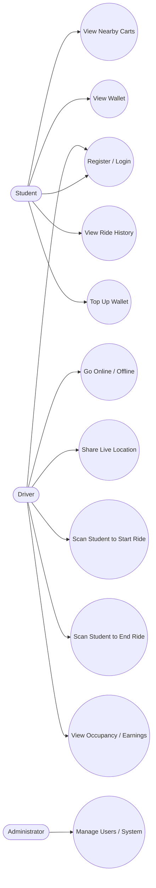
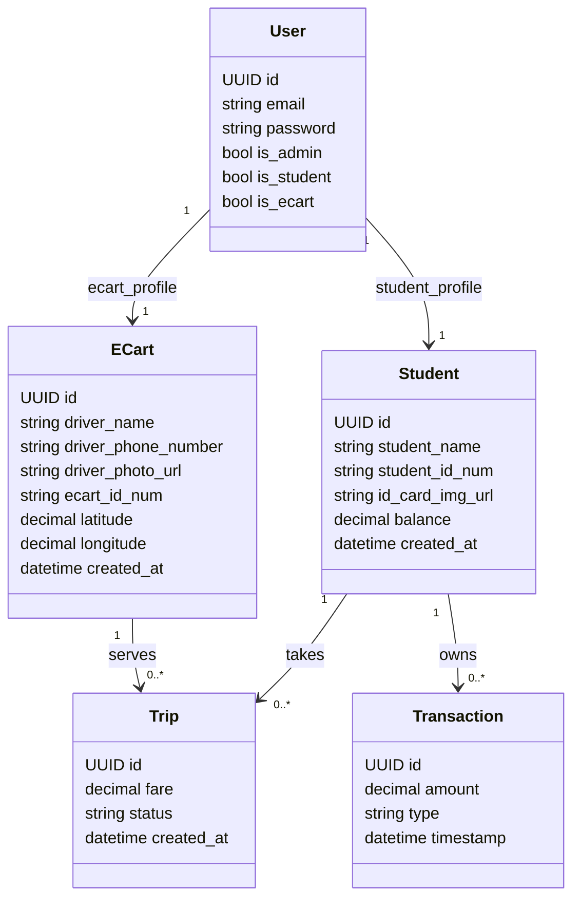
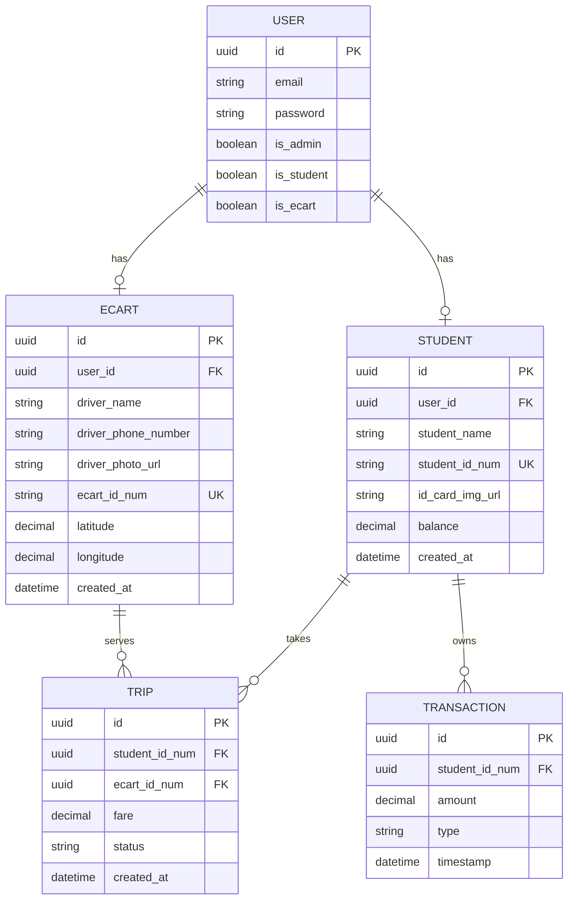
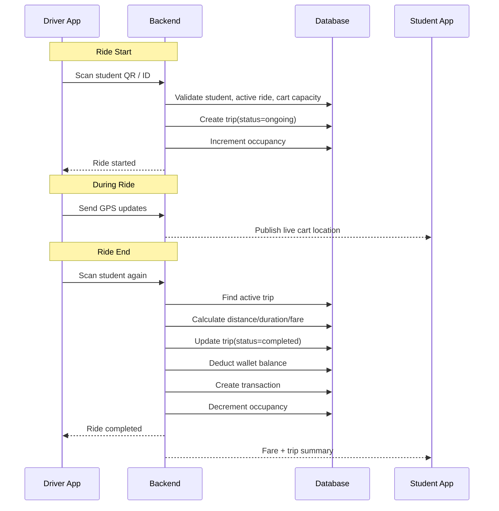

# GoCampus Backend

Professional backend documentation for the **GoCampus** campus transportation platform.

GoCampus connects **students** and **e-cart drivers** through a real-time transport system designed for campus mobility. The backend handles authentication, rider/driver profiles, trip lifecycle data, and the foundation for wallet-based fare processing and live vehicle tracking.

> **Repository status**
>
> This repository already contains the initial Django backend structure for authentication, student profiles, e-cart profiles, and trip records. Some product capabilities described below are **implemented**, while others are part of the **target architecture / roadmap**.

---

## Table of Contents

- [1. Product Summary](#1-product-summary)
- [2. Current Tech Stack](#2-current-tech-stack)
- [3. Business Goals](#3-business-goals)
- [4. Core User Roles](#4-core-user-roles)
- [5. Current Domain Model](#5-current-domain-model)
- [6. Target Domain Model](#6-target-domain-model)
- [7. Ride Lifecycle](#7-ride-lifecycle)
- [8. System Architecture](#8-system-architecture)
- [9. UML Use Case Diagram](#9-uml-use-case-diagram)
- [10. UML Class Diagram](#10-uml-class-diagram)
- [11. ER Diagram](#11-er-diagram)
- [12. Sequence Diagram: Start and End Ride](#12-sequence-diagram-start-and-end-ride)
- [13. API Surface](#13-api-surface)
- [14. Current Django Apps](#14-current-django-apps)
- [15. Data Model Details](#15-data-model-details)
- [16. Business Rules and Constraints](#16-business-rules-and-constraints)
- [17. Planned Real-Time Design](#17-planned-real-time-design)
- [18. Wallet and Fare Logic](#18-wallet-and-fare-logic)
- [19. Setup and Local Development](#19-setup-and-local-development)
- [20. Production Recommendations](#20-production-recommendations)
- [21. Roadmap](#21-roadmap)

---

## 1. Product Summary

**GoCampus** is a scan-based campus mobility platform.

### Problem it solves
Students need a fast and transparent way to use campus e-carts without manual cash collection, ambiguous pricing, or uncertainty about vehicle availability.

### Core idea
A student physically boards a cart, the driver scans the student's QR/ID, and the backend manages the ride session from start to finish.

### Intended platform capabilities
- Student and driver authentication
- Student and e-cart profile management
- Trip lifecycle management
- Live cart visibility on a map
- Occupancy tracking
- Automated fare calculation
- Wallet-based cashless payment
- Ride and transaction history

---

## 2. Current Tech Stack

### Implemented in this repository
- **Backend framework:** Django 5.x
- **API layer:** Django REST Framework
- **Authentication:** dj-rest-auth + allauth + JWT
- **Database (current default):** SQLite
- **Language:** Python

### Target production stack
- **Frontend:** React Native (Expo)
- **Backend:** Django
- **Database:** PostgreSQL
- **Cache / live location store:** Redis
- **Realtime transport:** WebSocket / pub-sub

---

## 3. Business Goals

GoCampus is designed around these principles:

- **No booking friction**: students board in the real world instead of making in-app reservations.
- **Simple driver workflow**: driver scans student to start and end rides.
- **Transparent billing**: fare is computed from trip metrics.
- **Operational visibility**: students can see active carts and occupancy.
- **Cashless campus mobility**: wallet deductions replace manual payment handling.

---

## 4. Core User Roles

### Student
A student can:
- register and log in
- maintain a wallet balance
- view available carts
- see cart occupancy and proximity
- ride without booking
- view trip history and fare deductions

### Driver / E-Cart Operator
A driver can:
- register and log in
- go online or offline
- share live location
- scan students when they board or exit
- monitor occupancy
- view trip and earnings summary

### Administrator
An administrator can:
- manage users
- verify and moderate the system
- monitor trips and platform operations
- manage policies, fares, and analytics in future versions

---

## 5. Current Domain Model

The repository currently includes the following main persistent models:

### `administrator.User`
Custom Django user with role flags:
- `is_admin`
- `is_student`
- `is_ecart`

### `student.Student`
Represents a student profile linked to a user:
- `id`
- `student` (OneToOne to User)
- `student_name`
- `student_id_num`
- `id_card_img_url`
- `balance`
- `created_at`

### `ecart.ECart`
Represents an e-cart / driver profile linked to a user:
- `id`
- `ecart` (OneToOne to User)
- `driver_name`
- `driver_phone_number`
- `driver_photo_url`
- `ecart_id_num`
- `latitude`
- `longitude`
- `created_at`

### `student.Trip`
Represents a trip between a student and an e-cart:
- `id`
- `student`
- `ecart`
- `fare`
- `status`
- `created_at`

> Note: the current `Trip.status` choices are `started`, `ongoing`, and `completed`, but the default value in code is `pending`, which should be corrected to avoid invalid state defaults.

---

## 6. Target Domain Model

To fully support the GoCampus product specification, the domain should evolve toward the following entities.

### Student
- id
- student_id_num
- password
- wallet_balance
- created_at

### Driver
- id
- name
- phone
- cart_id
- password
- is_online
- current_occupancy
- capacity

### Cart
- cart_id
- driver_id
- capacity
- current_location
- is_active

### Ride
- id
- student_id_num
- cart_id
- start_time
- end_time
- start_location
- end_location
- distance
- duration
- fare
- status

### Transaction
- id
- student_id_num
- amount
- type
- timestamp

### Suggested additional entities
- `WalletTopUp`
- `LiveCartLocation`
- `FarePolicy`
- `QRScanLog`
- `DriverSession`

---

## 7. Ride Lifecycle

The product is based on a **double-scan workflow**.

### 7.1 Boarding
1. Student boards the cart physically.
2. Driver scans the student's QR code or ID.
3. Backend validates:
   - student exists
   - student has no active ride
   - cart has available capacity
   - student wallet is sufficient for minimum ride threshold if policy requires
4. Backend creates a new ride record.
5. Cart occupancy increases.

### 7.2 During Ride
1. Driver app sends GPS updates every few seconds.
2. Backend stores latest cart location.
3. Student clients subscribed to updates see the cart move in real time.
4. Distance and duration can be computed progressively or finalized at ride completion.

### 7.3 Ending Ride
1. Driver scans the same student again.
2. Backend finds the active ride.
3. Ride is closed with end time and end location.
4. Distance, duration, and fare are computed.
5. Cart occupancy decreases.
6. Student wallet is deducted.
7. Transaction record is created.

---

## 8. System Architecture

```text
+------------------+        Web / API        +----------------------+
| Student Mobile   | <---------------------> | Django REST Backend  |
| App (Expo)       |                         | Auth / Trips / Wallet|
+------------------+                         +----------+-----------+
                                                        |
                                                        |
                                          +-------------+-------------+
                                          |                           |
                                          v                           v
                                 +----------------+          +----------------+
                                 | PostgreSQL     |          | Redis          |
                                 | Persistent DB  |          | Live locations |
                                 +----------------+          +----------------+
                                                        ^
                                                        |
+------------------+      WebSocket / GPS updates       |
| Driver Mobile    | -----------------------------------+
| App (Expo)       |
+------------------+
```

### Responsibility split
- **PostgreSQL**: users, carts, rides, transactions, wallet history
- **Redis**: latest live cart coordinates, volatile pub/sub state
- **WebSocket layer**: location streaming and event push
- **Django REST API**: auth, profile, wallet, history, ride state changes

---

## 9. UML Use Case Diagram



---

## 10. UML Class Diagram



> `Transaction` is part of the target model and not yet implemented in the current repository.

---

## 11. ER Diagram



---

## 12. Sequence Diagram: Start and End Ride



---

## 13. API Surface

### Current visible routes
From `server/server/urls.py`, the repository currently exposes:

#### Authentication
- `POST /rest-auth/login/`
- `POST /rest-auth/logout/`
- `POST /rest-auth/password/change/`
- `POST /rest-auth/password/reset/`
- `POST /rest-auth/password/reset/confirm/`
- `POST /rest-auth/registration/`
- `POST /rest-auth/registration/account-confirm-email/`
- `POST /get-access-token/`
- `POST /api/token/verify/`

#### Admin app routes
- `/administrator/` (currently mounted; actual endpoints depend on `administrator/urls.py`)

### Recommended future API groups

#### Student APIs
- `POST /api/students/register/`
- `POST /api/students/login/`
- `GET /api/students/profile/`
- `GET /api/students/wallet/`
- `GET /api/students/trips/`
- `GET /api/carts/nearby/`

#### Driver APIs
- `POST /api/drivers/register/`
- `POST /api/drivers/login/`
- `POST /api/drivers/status/online/`
- `POST /api/drivers/status/offline/`
- `POST /api/drivers/scan/start/`
- `POST /api/drivers/scan/end/`
- `POST /api/drivers/location/update/`

#### Ride APIs
- `GET /api/rides/{id}/`
- `GET /api/rides/active/`
- `POST /api/rides/start/`
- `POST /api/rides/end/`

#### Wallet APIs
- `POST /api/wallet/topup/`
- `GET /api/wallet/transactions/`

---

## 14. Current Django Apps

### `administrator`
Responsibilities:
- custom user model
- authentication extensions
- serializers and shared auth behavior

### `student`
Responsibilities:
- student profile model
- trip model
- student-facing business logic (to be expanded)

### `ecart`
Responsibilities:
- e-cart / driver profile model
- location and operational state (to be expanded)

### `all_auth_extended`
Responsibilities:
- allauth customization

### `utils`
Responsibilities:
- shared helpers and email handlers

---

## 15. Data Model Details

### Current implemented fields

#### User
| Field | Type | Notes |
|---|---|---|
| `is_admin` | boolean | role flag |
| `is_student` | boolean | role flag |
| `is_ecart` | boolean | role flag |

#### Student
| Field | Type | Notes |
|---|---|---|
| `id` | UUID | primary key |
| `student` | OneToOne(User) | owner user account |
| `student_name` | string | student name |
| `student_id_num` | string | unique campus/student identifier |
| `id_card_img_url` | URL | uploaded ID card reference |
| `balance` | decimal | wallet balance |
| `created_at` | datetime | auto-created |

#### ECart
| Field | Type | Notes |
|---|---|---|
| `id` | UUID | primary key |
| `ecart` | OneToOne(User) | owner user account |
| `driver_name` | string | driver display name |
| `driver_phone_number` | string | driver phone |
| `driver_photo_url` | URL | profile photo |
| `ecart_id_num` | string | unique cart identifier |
| `latitude` | decimal | latest known latitude |
| `longitude` | decimal | latest known longitude |
| `created_at` | datetime | auto-created |

#### Trip
| Field | Type | Notes |
|---|---|---|
| `id` | UUID | primary key |
| `student` | FK(Student) | rider |
| `ecart` | FK(ECart) | cart / driver |
| `fare` | decimal | total fare |
| `status` | string | started / ongoing / completed |
| `created_at` | datetime | creation time |

### Recommended schema expansion
To match the GoCampus product spec, these fields should be added in future migrations.

#### ECart additions
- `is_online: bool`
- `current_occupancy: int`
- `capacity: int`
- `is_active: bool`
- `last_location_updated_at: datetime`

#### Trip additions
- `start_time: datetime`
- `end_time: datetime`
- `start_latitude: decimal`
- `start_longitude: decimal`
- `end_latitude: decimal`
- `end_longitude: decimal`
- `distance_meters: decimal`
- `duration_seconds: int`
- `base_fare: decimal`
- `distance_fare: decimal`
- `time_fare: decimal`

#### New Transaction model
- `student`
- `trip`
- `amount`
- `type`
- `timestamp`
- `reference`

---

## 16. Business Rules and Constraints

The following rules should be enforced at the service layer and, where possible, at the database layer.

### Student rules
- A student can have only **one active ride** at a time.
- A student must have enough wallet balance before ride start or before ride completion, depending on policy.

### Cart rules
- A cart cannot exceed its configured capacity.
- A cart must be online to appear on the student map.
- A ride cannot start if the cart is inactive or unavailable.

### Trip rules
- A trip must always belong to one student and one e-cart.
- A completed trip must have end time and fare.
- Double-scan edge cases must be handled idempotently.

### Payment rules
- Every fare deduction should create a transaction record.
- Wallet balance must not become negative unless overdraft is intentionally supported.

---

## 17. Planned Real-Time Design

### Driver to backend
Driver app sends:
- current latitude
- current longitude
- timestamp
- cart identity
- optional occupancy snapshot

### Backend responsibilities
- authenticate socket/session
- validate cart identity
- update latest location in Redis
- optionally persist snapshots to PostgreSQL asynchronously
- broadcast updates to subscribed student clients

### Student app responsibilities
- subscribe to nearby carts
- render carts on map
- show occupancy and ETA
- update markers in near real time

### Suggested channels
- `cart:{cart_id}:location`
- `student-map:zone:{zone_id}`
- `ride:{ride_id}:events`

---

## 18. Wallet and Fare Logic

### Example fare formula
```text
fare = base_fare + (distance * distance_rate) + (time * time_rate)
```

### Example pricing configuration
- `base_fare = 5`
- `distance_rate = 0.02 per meter`
- `time_rate = 1 per minute`

### Example transaction flow
1. Student ends ride.
2. Backend calculates total fare.
3. Backend checks student balance.
4. Backend deducts fare from wallet.
5. Backend writes a transaction row.
6. Backend returns ride receipt.

### Recommended implementation detail
Store fare policy in a dedicated configuration table rather than hardcoding values.

---

## 19. Setup and Local Development

### Clone the repository
```bash
git clone https://github.com/tanimSk/gocampusbackend.git
cd gocampusbackend
```

### Create virtual environment
```bash
python -m venv .venv
source .venv/bin/activate
```

### Install dependencies
```bash
pip install -r requirements.txt
```

### Run migrations
```bash
cd server
python manage.py migrate
```

### Create superuser
```bash
python manage.py createsuperuser
```

### Start development server
```bash
python manage.py runserver
```

### Current default database
The repository is currently configured to use **SQLite** by default.

---

## 20. Production Recommendations

Before production deployment, the following should be addressed.

### Security
- move secrets out of source code and into environment variables
- disable `DEBUG=True`
- restrict `ALLOWED_HOSTS`
- restrict `CORS_ALLOW_ALL_ORIGINS`
- rotate any exposed SMTP credentials
- use secure JWT cookie settings if cookies are used

### Infrastructure
- switch from SQLite to PostgreSQL
- add Redis for live location streaming
- deploy ASGI with WebSocket support
- use Celery / background workers for asynchronous tasks if needed

### Code quality
- add serializers and viewsets for student/ecart/trip flows
- add automated tests
- add OpenAPI / Swagger documentation
- normalize naming (`Trip` vs `Ride`, `ECart` vs `Cart`) for long-term consistency

---

## 21. Roadmap

### Phase 1 — Solidify current backend
- finalize student registration/login
- finalize driver registration/login
- expose CRUD/profile APIs
- fix inconsistent trip status default
- add role-based permissions

### Phase 2 — Ride operations
- start ride endpoint
- end ride endpoint
- active ride lookup
- occupancy tracking
- duplicate-scan protection

### Phase 3 — Wallet and billing
- transaction model
- top-up flow
- fare computation service
- receipts and history

### Phase 4 — Real-time transport
- WebSocket channel design
- live cart tracking
- student map subscriptions
- ETA calculation

### Phase 5 — Operations and analytics
- admin dashboard
- demand heatmaps
- fraud detection
- offline sync support

---

## Notes for Contributors

If you are extending this backend, keep the architecture aligned with the product direction:
- **Trip state should be event-driven and explicit**
- **Wallet operations should be auditable**
- **Realtime data should be optimized for low latency**
- **Data integrity rules should be enforced server-side, not only in the client**

---

## License

Add your preferred license here if the project is intended for public collaboration.
